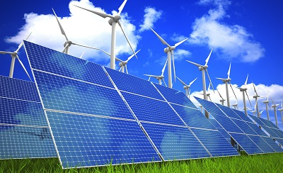

# Renewable-Energy-Use-in-the-EU-2015-2020                                                                  
A short analysis of renewable energy consumption across different EU member states and factors influencing types of renewable energy use.  

## Background  

The 2009 Renewable Energy Directive required the EU to fulfil at least 20% of its total energy needs with renewables by 2020.  Each EU member state set out their individual plans to meet agreed up0n individual targets in their National Renewable Energy Action Plans (NREAPs).  

Progress towards these targets is measured every two years when countries publish national renewable energy progress reports.  
  
In 2018, the target for renewable energy usage was raised to 34% and once more in 2021, the target has been adjusted to 40% since then. This is likely due to the recent developments in climate change projections and their far reaching consequences.  
   
Using data from Eurostat's Energy and Renewables databases (https://ec.europa.eu/eurostat/web/main/data/database) we will be looking at recent developments across the European27 geopolitical entities with an aim to answering the following questions:  

**1) What are the top 5 performing EU member states in terms of renewable energy use?  
**2) What are the most popular forms of energy used in these countries.   
**3) What are the most popular forms of energy in these countries?  
**4) Which EU member states consume the most energy annually, and what percentage of that consumption comes from renewable sources?  
**5) Which EU member states have made the most progress in terms of renewable energy usage from 2015 to 2019, which countries have made the least progress?  

The aim here is to identify:
- EU member states where there appears to be room for growth in the renewable energy sector (and thus where there might be early opportunities for investment in the renewable energy sector).  
- EU member states that appear to be pursuing renewable energy development aggressively (making the renewable energy sector a safe investment target)  
- Most popular renewable energy products in each of the above groups to determine the most profitable renewable product to invest in.  
- Possible factors influencing which renewable energy products might be best suited to different countries.  

## Additional questions
**- What factors if any might be able to explain different countries' levels of renewable energy use?   
**- What can we learn from the Top 5 countries in terms of Renewable energy use?   

## Repo Contents   
This repo includes:  
1. Individual csv files converted from the original xls sheets from the Eurostat Energy Database (https://ec.europa.eu/eurostat/data/database?node_code=nrg_bal_c)  
2. Cleaned csv files  
3. A jupyter notebook for cleaning and transforming data (Renewable_Energy_Performance_EU_cleaning.ipynb)  
4. A jupyter notebook for exploratory data analysis and preliminary visualization (Renewable_Energy_statistics_EDA.ipynb)  
5. A collection of csv files for EDA and visualization (EDA Notebook folder)  
6. Additional datasets for more in depth exploration and analysis of the renewable energy consumption, production and application habits of EU countries.  

## Have fun!  w
